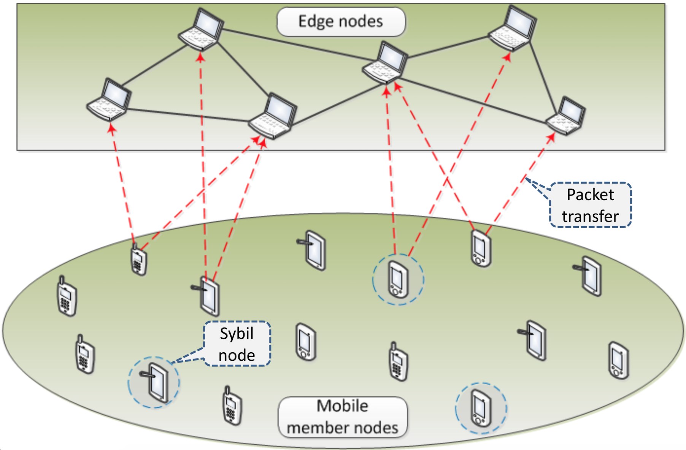

I am pursuing bachelor's degree in [Shanghai Jiao Tong University (SJTU)](http://en.sjtu.edu.cn/). I work under the supervision of [Prof. Virginia de Sa](http://www.cogsci.ucsd.edu/~desa/) and my research interest lies in machine learning and brain computer interface. 

Education
======
Shanghai Jiaotong University, Sep. 2015 to Jun. 2020 (expected)   

* Bachelor of Software Engineering
* Major GPA: 85.96/100, 3.62/4.0

Publications
======
* _Xuecheng Li, **Zhengyu Wu**, Ting Han. Gamification-Based VR Rowing Simulation System. HCI (2) 2019: 484-493_ [paper](https://link.springer.com/chapter/10.1007%2F978-3-030-22643-5_38)
* _Xibai Li, **Zhengyu Wu**, Yan Sun, et al. A Method to Diagnose Discoid Lateral Menisci on Radiographs Using Image Processing Tools and Machine Learning. Knee Surgery, Sports Traumatology, Arthroscopy (under review)_
* _**Zhengyu Wu**, Liwei Lin, Zhengui Xue, et al. A Novel Sybil Attack Detection Scheme Based on Edge Computing for Mobile IoT Environment (manuscript)_

Projects
======

<table class="tg">
  <tr>
    <th class="tg-oe15" width="30%">
      
    </th>
    <th class="tg-oe15">
      <b>Synchronize EEG data and video frames</b>   
      A programed LED light is used to synchronize EEG data and video frames. It's an important part that makes combining different data feasible. This work is advised by <a href="http://www.cogsci.ucsd.edu/~desa/">Prof. Virginia de Sa</a>.
    </th>
  </tr>
</table>

<table class="tg">
  <tr>
    <th class="tg-oe15" width="30%">
      
    </th>
    <th class="tg-oe15">
      <b>Gamification-Based VR Rowing Simulation System</b>   
      A VR Rowing Simulation System is implemented which brings in competition and reward mechanism. It significantly enhances the effectiveness of atheletes exercising according to our experiments. 
      <a href="https://link.springer.com/chapter/10.1007%2F978-3-030-22643-5_38">[paper]</a>
    </th>
  </tr>
</table>

<table class="tg">
  <tr>
    <th class="tg-oe15" width="30%">
      
    </th>
    <th class="tg-oe15">
      <b>A new method to diagnose discoid lateral menisci on radiographs </b>   
      Knee joint is segmented from an original radiograph image. Image enhancement and denoising tools are used to strengthen the image and remove noises. A specific algorithm was designed to build a model of the knee joint and measure the parameters. This work is advised by <a href="http://www.se.sjtu.edu.cn/teacher/teacherdetail.aspx?id=24">Prof. Yan Sun</a>.
    </th>
  </tr>
</table>

<table class="tg">
  <tr>
    <th class="tg-oe15" width="30%">
      
    </th>
    <th class="tg-oe15">
      <b>A Novel Sybil Attack Detection Scheme Based on Edge Computing for Mobile IoT Environment</b>   
      A new method is proposed to detect Sybil attack in mobile IoT environment and achieve 92% detection rate. Compared with other methods, our method has less memory overhead. This work is advised by <a href="https://ieeexplore.ieee.org/author/37858238200">Prof. Ruhui Ma</a>.
    </th>
  </tr>
</table>

<table class="tg">
  <tr>
    <th class="tg-oe15" width="30%">
      
    </th>
    <th class="tg-oe15">
      <b>Smart Garden APP and WEB </b>   
      A plat-crossing APP and WEB pages are built to controller shower nozzles in a garden. Shower nozzles are also self-adaptive according to the temperature and humidity of a garden.   
      <a href="https://github.com/zhengyu-wu/Smart-Garden">[code]</a>
    </th>
  </tr>
</table>

 
Honors & Awards
======
- Wish Company Scholarship (**Top 2%**)
- Academic Excellence Scholarship of Shanghai Jiao Tong University (**Top 10%**) 
- Excellent Student Cadre of Shanghai Jiao Tong University (**Top 0.5%, twice**) 
- National Second Prize in Mathematical Contest in Modeling (**Top 5%**)
- 4th Place in Odyssey of the Mind Competition Finals in Iowa, USA

Miscellaneous
======
- Social work
  - President of Building Management Committee in SJTU, Class Monitor
- Skills
  - Computer Skills: C++/C, Python, SQL, Java, TensorFlow, Springboot, React
  - Standardized Tests: TOFEL: 96, GRE: V: 152, Q: 169, AW: 3
- Interest
  - Basketball, Guitar, Photography, Reading, Traveling, Body-building